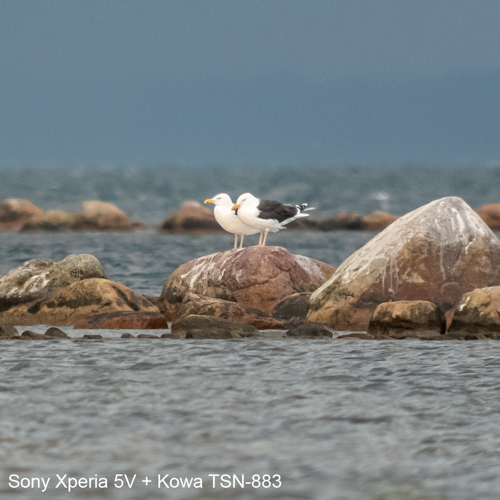
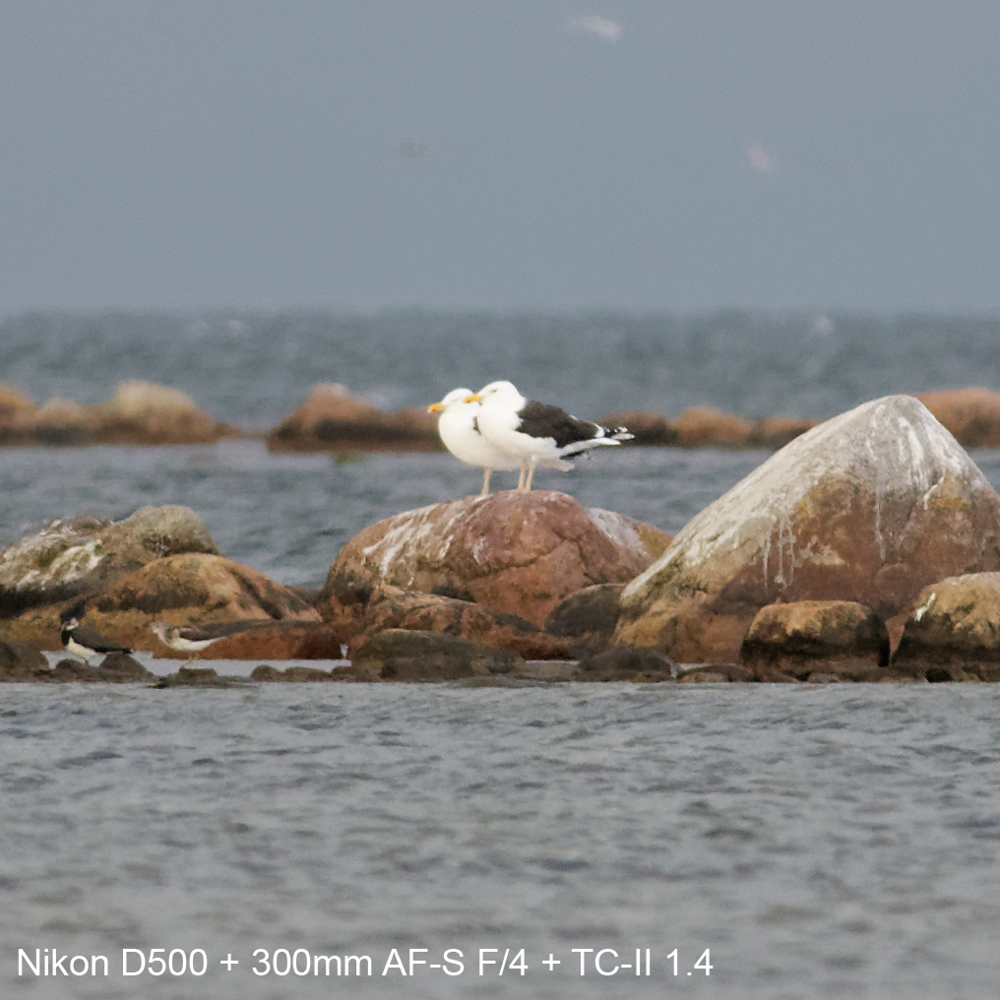
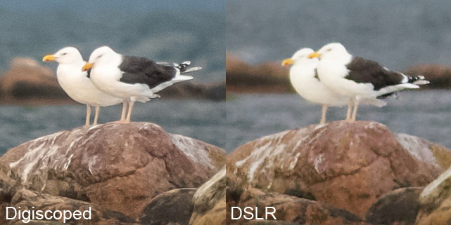
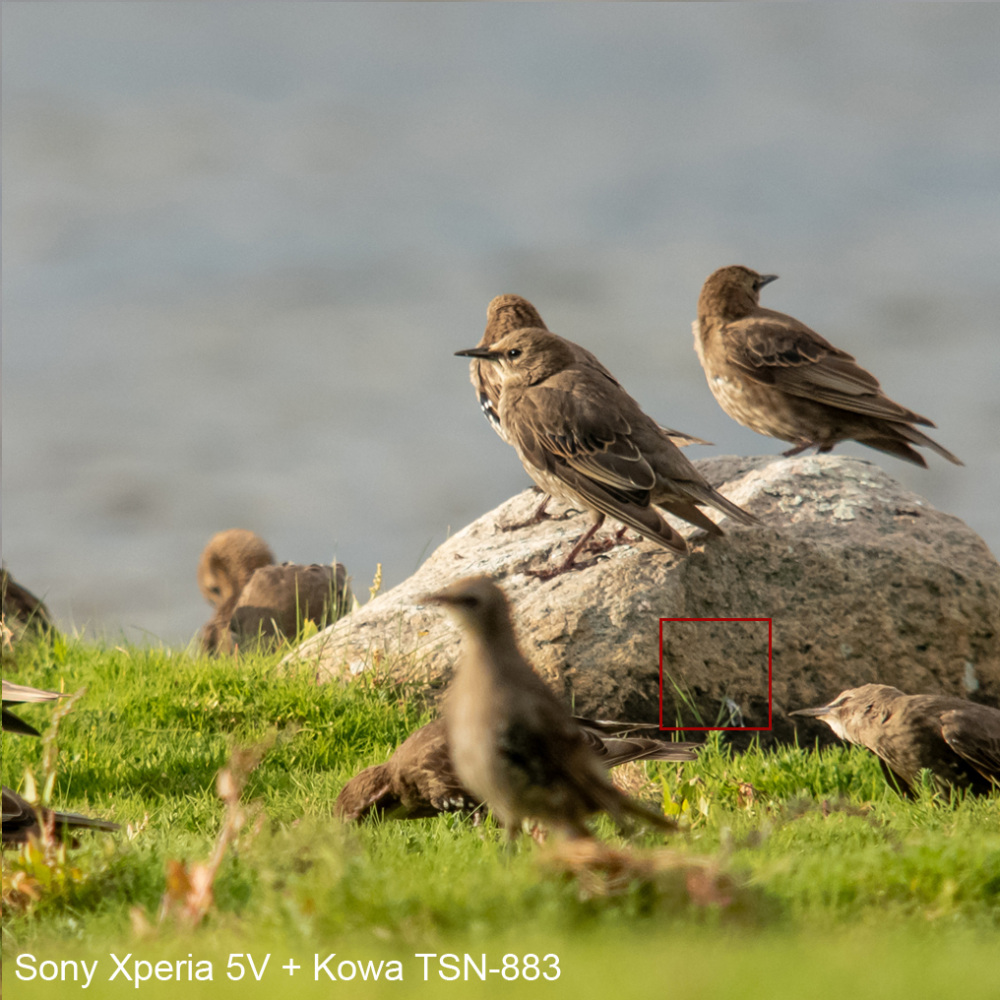
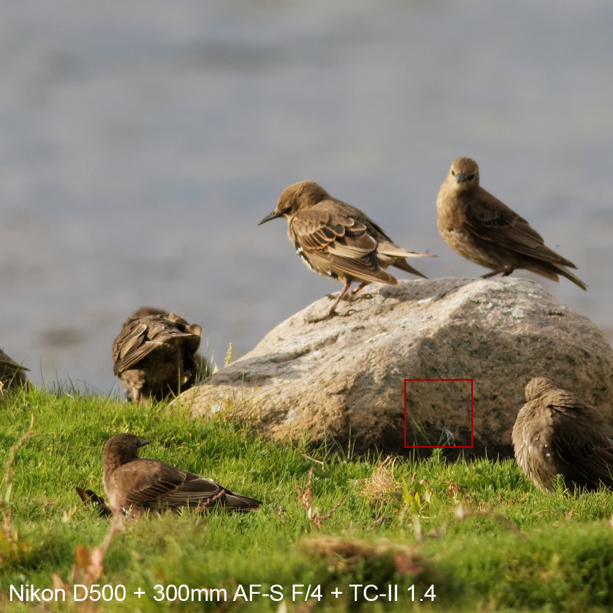
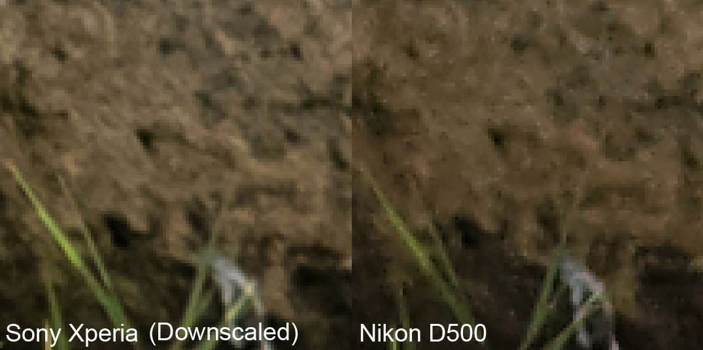
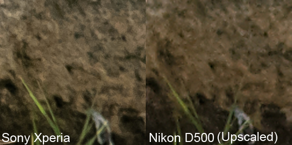

# Capturing information

Being a modern birder, it's quite important to take good photos. Proof of identification is without exception the difference between ecstacy and life-long bitterness over the one that got away. I quite recently got a new phone and I'm curious about its capabilities of taking good photos, both in terms of being able to absorb useful information on a pixel level, but also in terms of taking aesthetic photos of birds and their surroundings. This space is all about exploring this.

# Some notes on editing

All photos are shot in RAW format and are afterwards (subjectively) edited to look good. I prefer to shoot in RAW because that way I don't lock in a certain level of exposure, color balance, noise reduction, sharpening, etc. However, comparing unedited RAW files from different brands and cameras scares me because I believe that what photo editing programs show is not necessarily a representative and comparable visualization of the information that's embedded in the file. Right now, I have edited the phone pictures to look good on my phone, and then edit the camera photos to look as much like them as I can, within reason. I may do more technical processing in the future, but right now I'm settling for this method. 

# Sony Xperia 5V with Kowa TSN-883 *vs* Nikon DSLR

Below are a few photos comparing the digiscoping setup to a decent wild-life camera setup; a Nikon D500 + 300mm AF-S F/4 + TC-II Teleconverter.

In my opinion, the Xperia picture is clearer, less smudgy, and has more of a 3D feeling than the Nikon D500 picture. I also find the digiscoped picture less annoying to look at - my eyes aren't as confused about what they're seeing. 

Here they are side-by-side.

The Sony Xperia picture is clearly better, still, given how much range a digiscoping rig gets, I'm surprised the difference between them isn't bigger here. 

Below is a comparison of some starlings.

Given that main starling of comparison left the rock, let's compare less animate objects, like rocks and grass. I like how the grass as a whole looks on the Nikon shot. It looks more like real grass to me. I don't know if it has something to do with the editing. But let's do some pixel peeping in the red areas on the shots above. 

Below is a comparison of how the Sony Xperia shot looks when it's downscaled to match the size of the Nikon shot, and below that, how the Nikon shot looks when it is upscaled to match the Sony Xperia shot. 

To me, it's quite clear that the digiscoping setup with the Sony Xperia results in pictures with more "pixel control". In both comparisons, the Sony pictures are sharper, snappier, have more depth and fewer nonsensical artifacts. The blades of grass are more smooth and sharp. The Sony shots just seem to have higher density of information per real world unit.

As for the beauty of pictures, I believe the Sony has really high potential. I'll revisit both technical and aesthetic aspects in future posts.

