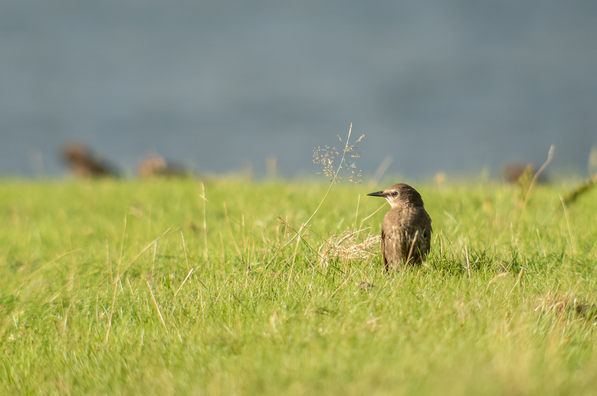

# Exploring the capabilities of a new phone

As a birder, getting good photos consistently is really important, as the difference between euphoria and catastrophe often depends on getting documentation that supports your claimed identification. I recently got a new phone and I'm curious about its capabilities, both in terms of being able to capture detailed information down to a pixel level, but also in terms of taking aesthetically pleasing photos of birds and their surroundings. This is a space to explore and document these aspects. Here, I will compare photos taken with the phone with photos taken with a proper camera setup. 

# Some notes on editing

I prefer to shoot in RAW for flexibility of exposure, color balance, noise reduction, and sharpening. I especially want avoid locking in noise reduction and sharpening which often result in ugly "digital" artefacts. However, comparing unedited RAW files from different cameras and brands can be misrepresentative since photo editing programs may not necessarily interpret the encoded data from different RAW formats in the same way. As of now, I have edited the phone pictures to look good on my phone, and then edited the camera photos to match them as closely as possible. I may do more comparable processing in the future, but this method works right now. 

# Sony Xperia 5V with Kowa TSN-883 *vs* Nikon DSLR  

Below are a few photos comparing the digiscoping setup to a decent wild-life camera setup; a Nikon D500 + 300mm AF-S F/4 + TC-II Teleconverter.

The Xperia picture appears clearer, less smudgy, and has more of a 3D feeling than the Nikon D500 picture. I also find the digiscoped picture to have a calmer appearance and my eyes aren't as confused about what they're seeing. 

The upper photo has a much deeper blue color in the distance; the difference is due to a heavy rain in background of the second photo.

Here is a side-by-side.

The Sony Xperia picture is clearer. However, given how much range a digiscoping rig gets, I'm surprised the difference between them isn't bigger, in this case. 

Below is a comparison of some starlings.

Given that the starling in focus on the first picture left the rock, and the one behind is out of focus, let's compare more stable areas of the picture, like those in the red areas on the shots above.

Below are two comparison photos. The first shows the Sony Xperia shot downscaled to match the Nikon's resolution, and the second shows the Nikon shot upscaled to match the Sony Xperia's resolution.

To me, it's clear that the digiscoping setup with the Sony Xperia results in pictures with better 'pixel control.' In both comparisons, the Sony pictures are sharper, have more depth, and fewer artifacts. The blades of grass appear smoother and sharper. The Sony shots seem to have a higher density of information of the real world.

As for the aesthetic pleasure of pictures, I believe the Sony has high potential.

