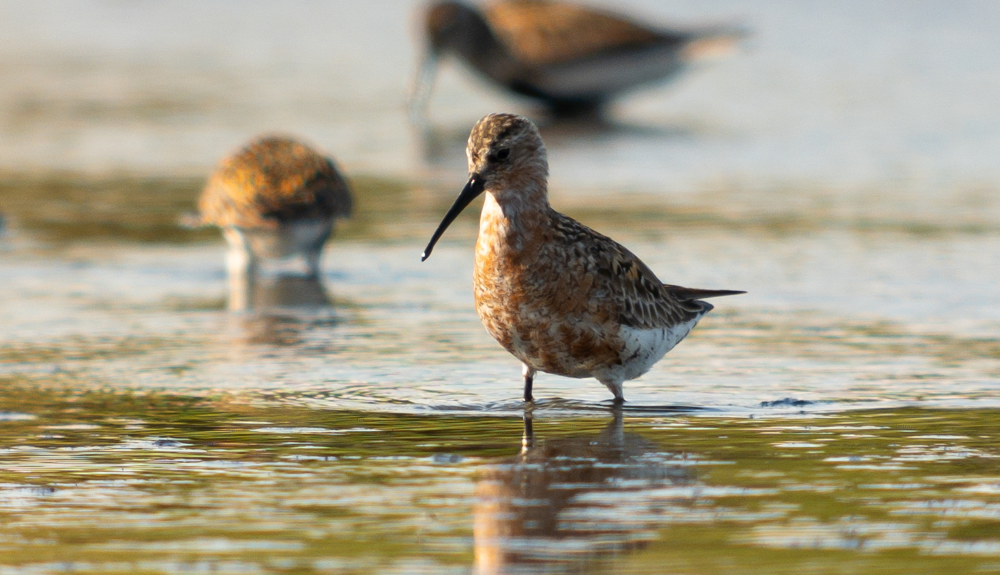
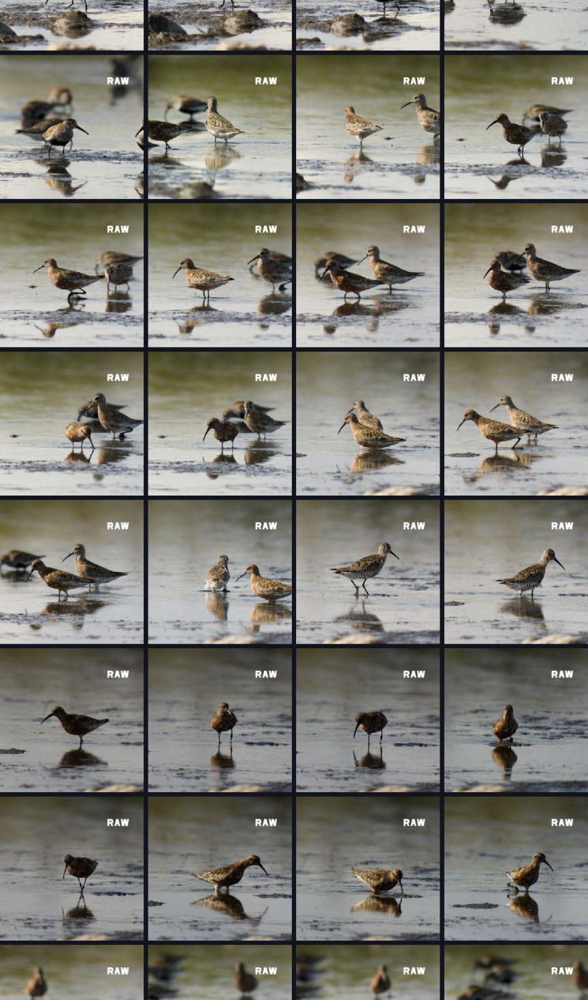
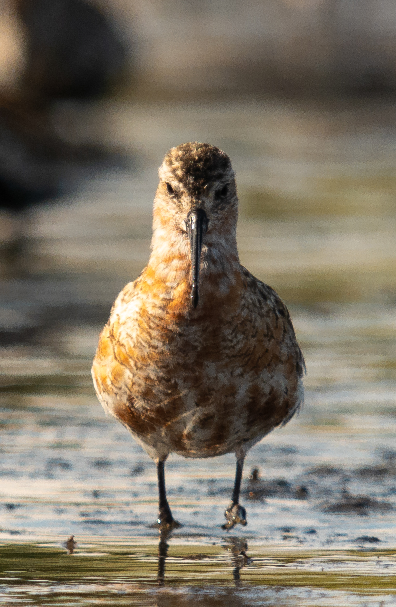

# A session with waders

A few weeks ago I went to eastern Öland to look at waders. It was the first time using the digiscoping setup properly. 

# Focus peaking

First of all, I'm impressed by the ability of the phone to snap into focus despite the scope being *out of focus*. With digiscoping, you have to guess approximately where the focus of the scope is and let the phone do the final adjusting. Or, if you are using manual focus, you have to see on the phone screen if the photo is in focus. In both cases focus peaking works wonders. 

> ["Focus peaking is a focusing aid in live preview or electronic viewfinders on digital cameras that places a white or coloured highlight on in-focus edges within an image using an edge detect filter"](https://en.wikipedia.org/wiki/Focus_peaking)

The Sony Xperia 5V has focus peaking and from now on I will never have a phone that doesn't have it. It's so incredibly useful both while in autofocus and manual mode. 

# Repeatability of focus

I went through the pictures one by one and classified focus. From 160 pictures, a pretty high proportion (85%) of the pictures had a satisfying focus point. The ones that weren't were due to motion blur on the rapidly moving head or, more commonly, due to focusing on the body or back instead of the head, making the pictures useless in any aesthetic sense. Both are user errors rather than the fault of the technology. 

My favorite photo from the wader session is this curlew sandpiper directly from the front. 

