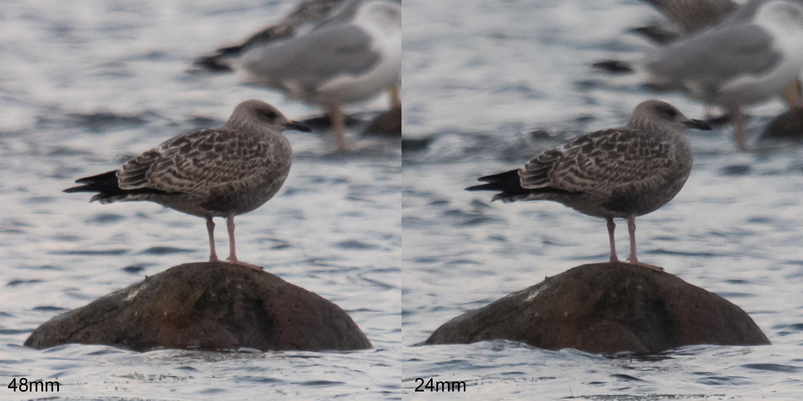
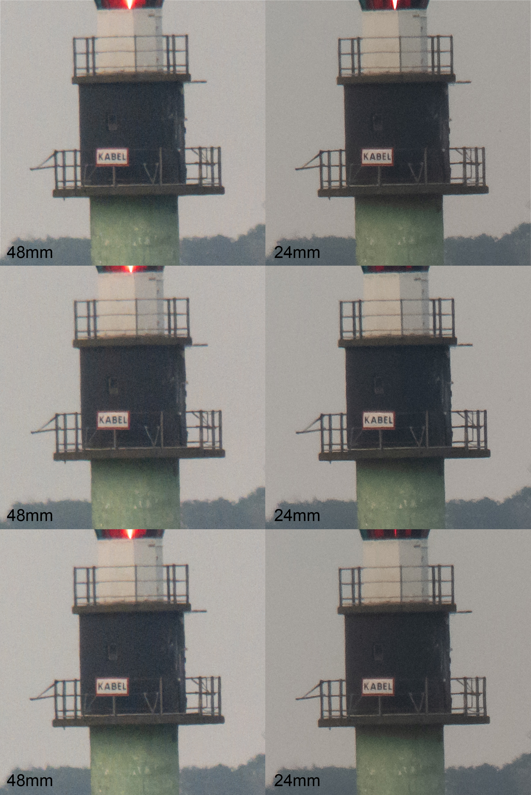
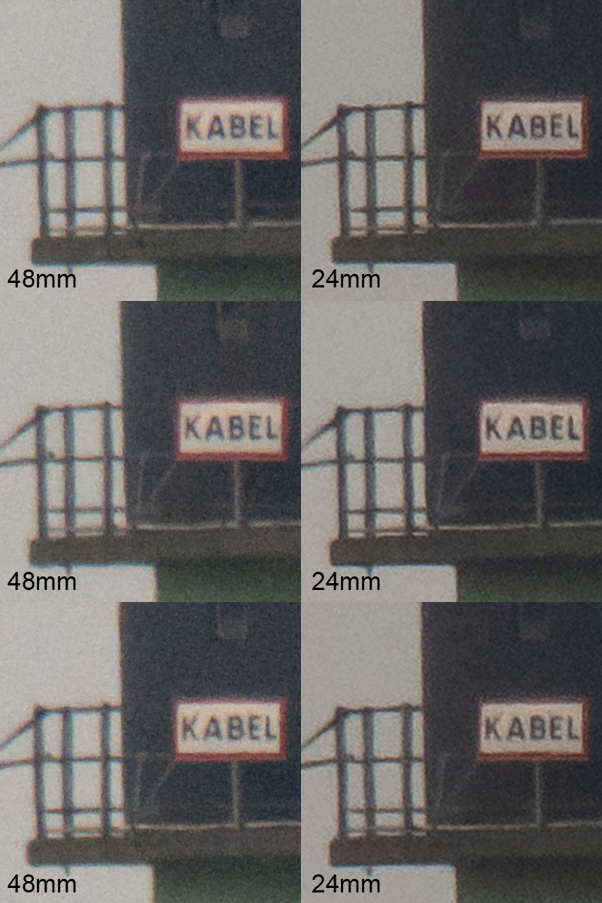

The sensor on the 5V is a 48-megapixel sensor, but the largest output is 12-megapixel photos. This is because the sensor combines 4 'sensor pixels' to produce 1 'image pixel' in the 24mm mode, a process called pixel binning. This likely results in reduced noise but at the cost of resolution.

In the 48mm mode, photos are twice as zoomed in, but the output is still 12 megapixels. However, they are not digitally upscaled. As I understand it, photos in the 48mm mode are captured by individual sensor pixels in the center of the sensor, so there is no pixel binning. This means that the 2x zoom is not a digital zoom but a type of "optical zoom" achieved by capturing (and keeping) the information on a finer scale. 

Sony writes the following:
> ["48mm is equivalent to 2x optical focal length, so you can capture the subjects of your images in a larger size without worrying about image quality deterioration."](https://www.sony.eu/presscentre/sony-introduces-its-latest-premium-smartphone-xperia-5-v) 

This implies that bird photographers - who often only use the central area of photos where the bird is - can chose not to pixel bin, and instead use the 48mm mode where the sensor's native resolution is utilized.

But what differences are there between the two modes, in practice? Is unbinned native resolution king, or does binning provide a less noisy and therefore a better result? 

# Digiscoping with the two modes

## Low light situations

I took pairs of pictures with 24mm and 48mm mode, respectivelyu. I then imported the RAW photos into Lightroom (the free version on Android) and directly exported to .jpg with the baseline settings. The photos were then imported into Photoshop CS2 where the 24mm photos are upscaled 200% to match the size of the 48mm photo, and finally put side-by-side.

The 24mm mode seem to collect slightly more light, as the ISO decreases when switching from 48mm to 24mm at the same brightness. 

To me, the 24mm photo of the adult herring gull looks more distinct and snappy. It's also less noisy and have more depth.

Not sure if I see any difference between the photos of the young herring gull.

Below are some pictures of a lighthouse 2.24 kilometers away from where I was standing. I also put three photos side-by-side to provide some replication due to individual sample differences. 

Again, the 24mm pixel binned pictures look more distinct to me. A little less flat. 

Zooming in further confirms that the 24mm photo samples are more distinct. But they also have some what I would consider sharpening artifacts.

# Not all same gen Xperia phones have the 48mm mode

The bigger sister of the 5V, the 1V, does not support 48mm mode, [much to the dismay of its users](https://www.reddit.com/r/SonyXperia/comments/1d8nbpi/im_still_trying_to_bring_the_48mm_mode_to_the/). The 1V utilizes digital upscaling in its 48mm mode. It's a strange choice by Sony. I did not know about this before I bought the 5V, meaning I accidentally bought the right phone. At least I have the option to chose.

