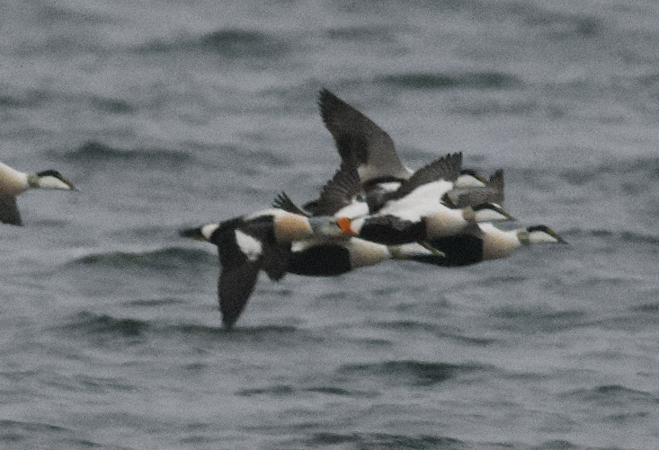

Last year I made a gif out of a series of photos of a King Eider [(migrating north at Mörbylånga 2024-03-23)](https://artportalen.se/Image/5058415). 

I loaded each photo as a layer into a Photoshop project, moved each photo so that the eye of the King Eider was centered across all photos, and finally cropped all the stacked photos in the same position. I then used the `R` package `magick` to string all of the photo files into an animated .gif.
