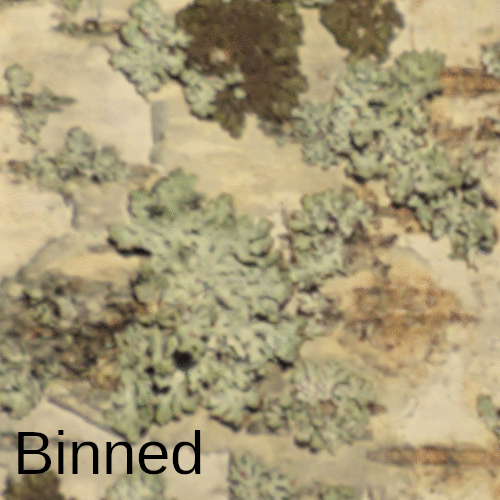

I don't know why I didn't revisit this sooner. I've been wondering about it for over a year. Anyway, unbinned (48mm mode, 12 megapixel) is far superior to binned (24 mm mode, 12 megapixel), at least in good light conditions. I took two photos of a well lit tree trunk, scaled up the binned version 200%, overlapped them, and cropped the very middle. There is a significant increase in the amount of information in the unbinned shot. It's noisier (as it should be), but it has more detail. I'll let the comparison .gif speak for itself. 

This was with the Kowa TSN-883 at 25x (meaning a lot of light). I guess experimenting with the zoom is next. I wonder if there is a perfect zoom level where you reap the gains of more magnification while not losing lose too much light. 

